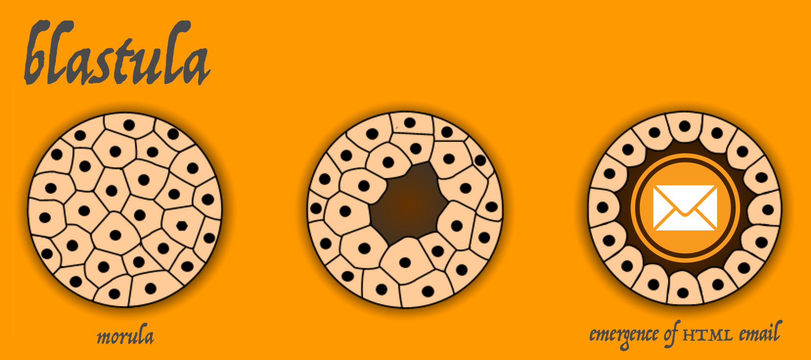
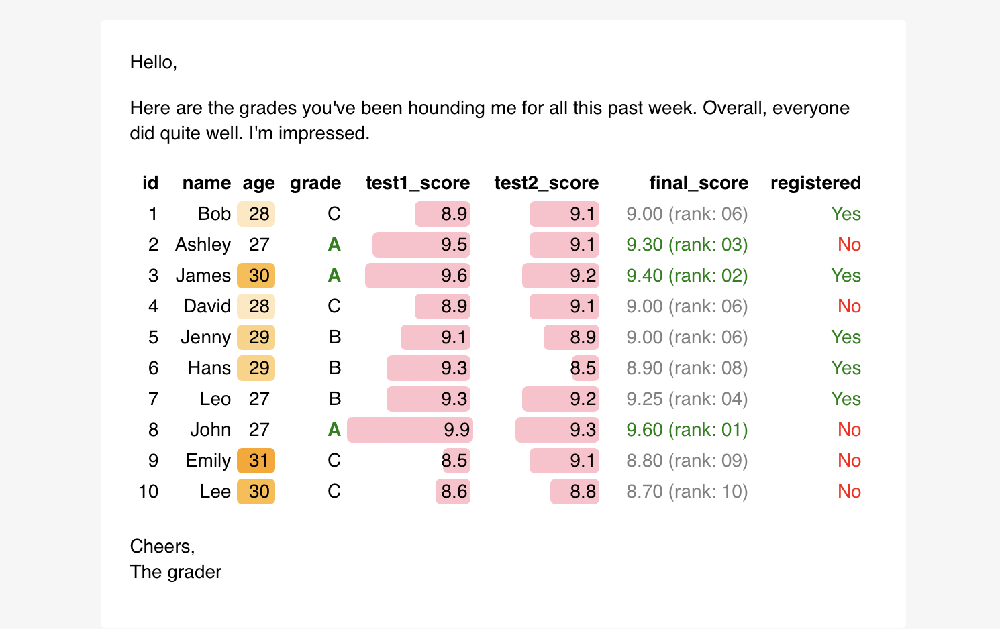

<!-- README.md is generated from README.Rmd. Please edit that file -->

```{r setup, include = FALSE}
knitr::opts_chunk$set(
  collapse = TRUE,
  comment = "#>",
  fig.path = "man/figures/README-",
  out.width = "100%"
)
```



[](https://travis-ci.org/rich-iannone/blastula)
[](https://codecov.io/github/rich-iannone/blastula?branch=master)

Sometimes we need to send out email messages based on the results of automated analysis processes. The **blastula** package makes it easy to send out HTML emails from R that are a little bit easier on the eyes. In doing so we can take advantage of both **Markdown** and R code when composing our email text.

### Installation Requirements

The **blastula** package requires the availability of `openssl`. 

On OS X, it is recommended that homebrew be used to install `openssl`:

```
brew install openssl
```

On RHEL, Fedora, or CentOS, `openssl-devel` is necessary:

```
sudo yum install openssl-devel
```

With Ubuntu or Debian, we need `libssl-dev`:

```
sudo apt-get install -y libssl-dev
```

### Sending an email message

Here's an example that shows a basic workflow for composing the message, previewing the content, creating optional on-disk credentials for email, and sending out the message.

These four functions can help us do just that:

- `compose_email()`: generates the email message content inside the `email_message`-class object
- `preview_email()`: makes the email message created by `compose_email()` viewable in the **RStudio** Viewer
- `send_email_out()`: sends the HTML-based email to one or more recipients
- `create_email_creds_file()`: generates an optional on-disk file with email credentials

Some helper functions allow for easy insertion of HTML fragments into the message body. These are:

- `add_image()`: with a local image file, insert it into message (it resizes the image to fit the content area)
- `add_readable_time()`: adds the current time as a nicely readable string.
- `add_cta_button()`: add a call-to-action (CTA) button with button text and a link
- `add_ggplot()`: add a ggplot plot object as an inline image

When you compose an email, you can put character objects from the global workspace into the message content. Here, I'll create a nicely formatted date/time string (`current_date_time`) with the package's `add_readable_time()` function, and, assign a link to an web image to an object (`img_link`).

```r
library(magrittr)

# Get a nicely formatted date/time string
current_date_time <- add_readable_time()

# Assign a very long image URL to `img_link`
img_link <-
  "https://marketplace.canva.com/MAA_AbacFmo/2/0/thumbnail_large/canva-basic-good-vibes-email-header-MAA_AbacFmo.jpg"
```

Now, we can use the `compose_email()` to compose the email! There are two main arguments here, `body` and `footer`. You can supply **markdown** text to each of these. All other valid **markdown** conventions should render to valid HTML.

The insertion of HTML fragments or text can be performed by enclosing valid R code inside of curly braces (`{...}`). Below the image URL (as part of the `` **markdown** link construction) is referenced to the `img_link` object from the global workspace. Note also that `{current_date_time}` references the `current_date_time` character object generated earlier via the `add_readable_time()` function. The end result is the insertion of the date/time string into the footer of the email. (Alternatively, `add_readable_time()` could have been called directly.)

We can also supply variables in the `compose_email()` function directly. For example, the `{sender}` part references an object *not* in the global workspace. Rather, it refers the named argument `sender = "Mike"` in the function call. The order of searching is from within the function first, then, the search moves to variables in the global environment.

```r
library(blastula)

email_object <-
  compose_email(
    body = "
  ## Hiya! This is an email message. Exciting Right?
  Enjoy it. And this here image:

  
      
  **Yeah!** I seriously hope that you enjoy this \\
  message and the good vibes it will bring to you \\
  and yours.
  
  Peace out,

  {sender}",
    footer = 
  "Brought to you by Smile AG on {current_date_time}",
    sender = "Mike")
```

Some more notes on style are useful here. The `\\` is a helpful line continuation marker. It'll help you break long lines up when composing but won't introduce line breaks or new paragraphs. I recommend formatting like above with few indents so as not to induce the `quote`-type formatting. Any literal quotation marks should be escaped using a single `\`. Blank lines separating blocks of text result in new paragraphs. And, again, any valid R code can be enclosed inside `{...}` (e.g., `{Sys.Date()}`).

After creating the email message, you'll most certainly want to look at it to ensure that the formatting is what you want it to be. This is done with the `preview_email()` function.

```r
library(blastula)

# Preview the email
preview_email(email = email_object)
```

...and this is what I saw:


I'd previously set up my email credentials in a file using the `create_email_creds_file()` function. Here's an example of how one might create a creds file as a hidden file in the home directory (`~`).

```r
# Create a credentials file to facilitate
# the sending of email messages
create_email_creds_file(
  user = "have_a@blastula.org",
  password = "<user_password>",
  host = "smtp.blastula.org",
  port = 465,
  sender = "correspondences@blastula.org",
  creds_file_name = "~/.e_creds)
```

You can also use preset SMTP settings. For example, if you'd like to send email through **Gmail**, we can supply `provider = gmail` to not have to worry about SMTP settings:

```r
# Create a credentials file for sending
# email through Gmail
create_email_creds_file(
  user = "user_name@gmail.com",
  password = "<user_password>",
  provider = "gmail",
  sender = "Sender Name")
```

This will create a hidden credentials file in the working directory, the name of which is based on the provider (you can optionally specify the name with the `creds_file_name` argument, as in the first example).

One additional note about using **Gmail** to send out email: you must first change account settings to let less secure apps use your account. Details on how to make this account-level change can be found in [this support document](https://support.google.com/accounts/answer/6010255).

Having generated that file, you can use the `send_email_out()` function to send the email. I sent the email just to myself but do note that the `to` argument can accept a vector of email addresses for mass mailings. Alternatively, one can set a number of environment variables and use `Sys.getenv()` calls for email credentials arguments in the `send_email_out()` statement.

```r
library(blastula)

# Sending email using a credentials file
send_email_out(
  message = email_object,
  from = "mike@smile.de",
  to = "riannone@me.com",
  subject = "This is NOT junk mail.",
  creds_file = "~/.e_creds")
  
# Sending email using environment variables
send_email_out(
  message = email_object,
  from = "mike@smile.de",
  to = "riannone@me.com",
  subject = "This is NOT junk mail.",
  sender = Sys.getenv("BLS_SENDER"),
  host = Sys.getenv("BLS_HOST"),
  port = Sys.getenv("BLS_PORT"),
  user = Sys.getenv("BLS_USER_NAME"),
  password = Sys.getenv("BLS_PASSWORD"))
```

This is how the message appeared when received in the email client:


The underlying HTML/CSS is meant to display properly across a wide range of email clients and webmail services.

### Adding a table to an email message

You can add HTML tables to the message. Here's an example using a **formattable** table generated via its `format_table()` function.

```r
library(blastula)
library(formattable)

# Create a data frame
df <- data.frame(
  id = 1:10,
  name = c("Bob", "Ashley", "James", "David", "Jenny", 
           "Hans", "Leo", "John", "Emily", "Lee"), 
  age = c(28, 27, 30, 28, 29, 29, 27, 27, 31, 30),
  grade = c("C", "A", "A", "C", "B", "B", "B", "A", "C", "C"),
  test1_score = c(8.9, 9.5, 9.6, 8.9, 9.1, 9.3, 9.3, 9.9, 8.5, 8.6),
  test2_score = c(9.1, 9.1, 9.2, 9.1, 8.9, 8.5, 9.2, 9.3, 9.1, 8.8),
  final_score = c(9, 9.3, 9.4, 9, 9, 8.9, 9.25, 9.6, 8.8, 8.7),
  registered = c(TRUE, FALSE, TRUE, FALSE, TRUE, TRUE, TRUE, FALSE, FALSE, FALSE),
  stringsAsFactors = FALSE)

# Create an HTML table with `format_table()`
formatted_table <-
  format_table(
    x = df,
    list(
      age = color_tile("white", "orange"),
      grade = 
        formatter(
          "span",
          style = x ~ ifelse(
            x == "A", 
            style(color = "green", font.weight = "bold"), NA)), 
      area(col = c(test1_score, test2_score)) ~ normalize_bar("pink", 0.2),
      final_score = 
        formatter(
          "span",
          style = x ~ style(color = ifelse(rank(-x) <= 3, "green", "gray")),
          x ~ sprintf("%.2f (rank: %02d)", x, rank(-x))),
      registered = 
        formatter(
          "span",
          style = x ~ style(color = ifelse(x, "green", "red")),
          x ~ icontext(ifelse(x, "ok", "remove"), ifelse(x, "Yes", "No")))
    ))
    
# Create and preview the email message
compose_email(
  body = "
  Hello,

  Here are the grades you've been hounding me \\
  for all this past week. Overall, everyone did \\
  quite well. I'm impressed.

  {formatted_table}
  <br />
  Cheers,<br />The grader") %>%
  preview_email()
```

This is how the email preview appears:



Bear in mind that wider tables can break across the content areas, so, previewing the message is vital (along with recognizing whether recipients will be primarily viewing on mobile or desktop).

### Adding a call-to-action (CTA) button to an email message

You can add a CTA button to the message. Simply use the `add_cta_button()` helper function, which generates an HTML fragment that can be injected into the message. The function can be called either in the global environment (referencing the object `cta_button` inside `{...}` as below) or called within the email message body itself (which is less recommended due to readability considerations).

```r
library(blastula)

# Create a CTA button as an
# HTML fragment to be included
# in the message
cta_button <-
  add_cta_button(
    url = "http://www.thebestwebsite.com",
    text = "Press This Button",
    align = "center")

# Compose the email and include the
# `cta_button` HTML fragment in a
# single line
compose_email(
  body = "
  Hello!

  Below is a call. It's a call to \\
  action. Press it!

  {cta_button}

  (I really hope you press it.)

  Cheers
  ") %>%
  preview_email()
```

This is how the email preview appears:


### Adding a local image to an email message

It's really a cinch to include images hosted on the Web using the Markdown approach shown earlier. For local image files we can use the `add_image()` helper function, which creates an HTML fragment that can be placed into the message wherever you'd like the image to appear. Again, this function can be used either in the global environment or within the email message body itself. I'll point to image that is available in the package.

```r
library(blastula)

# Create an HTML fragment that
# contains an image
img_file_path <-
  system.file(
    "img",
    "test_image.png",
    package = "blastula")

img_file_html <-
  add_image(
    file = img_file_path)

# Include the image in the email
# message body by simply referencing
# the `img_file_html` object
compose_email(
  body = "
  Hello!
  
  Take a look at this image:

  {img_file_html}

  It is of color bars.
  ") %>%
  preview_email()
```

This is how the email preview appears:


### Adding a ggplot plot object to an email message

It's not at all difficult to insert a **ggplot** plot into an email message. The function to use for that is `add_ggplot()`. An example:

```r
library(blastula)
library(ggplot2)

# Create a ggplot plot object
plot <- 
  ggplot(
    data = mtcars,
    aes(
      x = disp, y = hp,
      color = wt, size = mpg)) +
  geom_point()

# Let's use the `add_ggplot()`
# helper function right inside the
# email message body this time
compose_email(
  body = "
  Hello!
  
  Take a look at this plot:
  
  {add_ggplot(plot_object = plot, width = 5, height = 5)}
  
  It's a nice plot.
  
  Cheers
  ") %>%
  preview_email()
```

This is how the email preview appears:


### Adding HTML tags with inline CSS

You can add custom HTML within the markdown text. This provides an opportunity to style the text using inline CSS. In this example, header text is centered with the `text-align` style and link text is rendered in the `code` style using `<code>` tags. 

```r
library(blastula)

# Center the header text with some HTML tags, and,
# use the <code> tag for a link
compose_email(
  body = "

  <h2 style=\"text-align:center;\">This Heading is Centered</h2>

  That worked because we can insert HTML tags and \\
  include inline CSS. Check out this webpage for \\
  more information on this topic:

  <code>[CSS Align](https://www.w3schools.com/css/css_align.asp)</code>

  Cheers
  ") %>%
  preview_email()
```

This is how the email preview appears:


### Installation of the package

**blastula** is used in an R environment. If you don't have an R installation, it can be obtained from the [**Comprehensive R Archive Network (CRAN)**](https://cran.r-project.org/).

The **CRAN** version of this package can be obtained using the following statement:

```r
install.packages("blastula")
```

You can install the development version of **blastula** from **GitHub** using the **devtools** package.

```r
devtools::install_github("rich-iannone/blastula")
```

If you encounter a bug, have usage questions, or want to share ideas to make this package better, feel free to file an [issue](https://github.com/rich-iannone/blastula/issues).

## Code of Conduct

[Contributor Code of Conduct](https://github.com/rich-iannone/blastula/blob/master/CONDUCT.md). By participating in this project you agree to abide by its terms.

## License

MIT &copy; Richard Iannone
