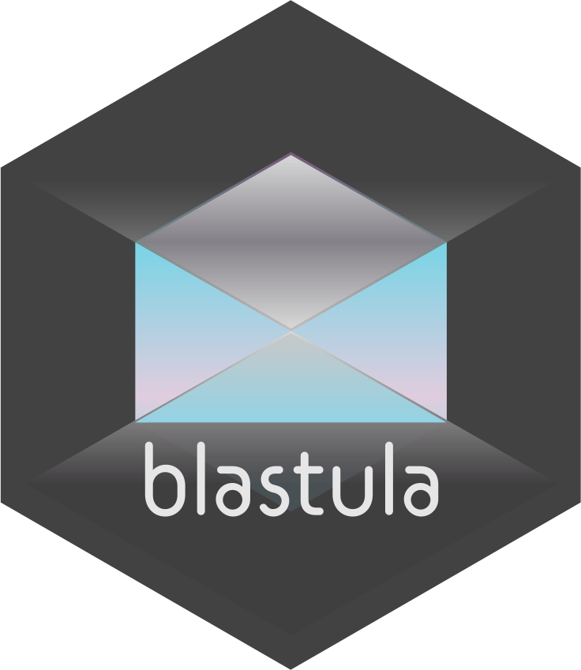
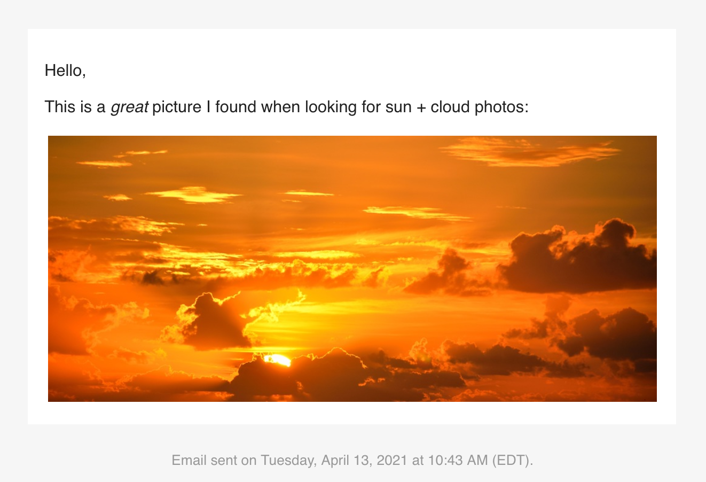

<!-- README.md is generated from README.Rmd. Please edit that file -->

```{r setup, include = FALSE}
knitr::opts_chunk$set(
  collapse = TRUE,
  comment = "#>",
  fig.path = "man/figures/README-",
  out.width = "100%"
)
```

```{r packages, message=FALSE, warning=FALSE, include=FALSE}
library(blastula)
```

# blastula <a href='http://rich-iannone.github.io/blastula/'></a>

[](https://CRAN.R-project.org/package=blastula)
[](https://travis-ci.org/rich-iannone/blastula)
[](https://codecov.io/gh/rich-iannone/blastula?branch=master)

## Overview

The **blastula** package makes it easy to produce and send HTML email from **R**. The message can have three content areas (the body, the header, and the footer) and we can insert **Markdown** text, block-based components, and even HTML fragments. The underlying HTML/CSS is meant to display properly across a wide range of email clients and webmail services. The resulting email message is responsive so it'll look great on both large displays and mobile devices.

### Composing an Email Message

When you compose an email, you can use objects from the global workspace and work them into the message content. Let's create a nicely formatted date/time string (`date_time`) with the `add_readable_time()` function, and, transform an image on disk to an HTML string object (`img_string`).

```{r local_variables}
# Get a nicely formatted date/time string
date_time <- add_readable_time()

# Create an image string using an on-disk
# image file
img_file_path <-
  system.file(
    "img", "pexels-photo-267151.jpeg",
    package = "blastula"
  )

img_string <- add_image(file = img_file_path)
```

Now we use the `compose_email()` function to compose the email. There are three main arguments here: `body`, `header`, and `footer`. You can supply **Markdown** text to any of these content areas to get rendered HTML.

In the example code below, the strings that are part of the email body and the email footer are combined with `c()` and, since we have Markdown and HTML fragments, we need to use the `md()` function.

```{r compose_email}
email <-
  compose_email(
    body = md(
      c(
"Hello,

This is a *great* picture I found when looking
for sun + cloud photos:
",
img_string
      )
    ),
footer = md(
  c(
    "Email sent on ", date_time, "."
  )
)
  )
```

After creating the email message, we can look at it to ensure that the formatting is as expected. Simply call the object itself and it will be displayed in the Viewer.

```{r preview_email, eval=FALSE}
# Preview the email
email
```



### Sending an Email Message via SMTP

We can store SMTP email credentials in a file using the `create_smtp_creds_file()` function. This will create a hidden credentials file in the working directory. We can also set SMTP access credentials in the system-wide key-value store through the `create_smtp_creds_key()` function.

Having generated a credentials file, we can use the `smtp_send()` function (along with the `creds_file()` credentials helper function) to send the email through an SMTP server.

```{r smtp_send, eval=FALSE}
# Sending email by SMTP using a credentials file
email %>%
  smtp_send(
    to = "jane_doe@example.com",
    from = "joe_public@example.net",
    subject = "Testing the `smtp_send()` function",
    credentials = creds_file("email_creds")
  )
```

## Installation

The **blastula** package can be installed from CRAN with `install.packages()`.

```{r install_cran, eval=FALSE}
install.packages("blastula")
```

You can install the in-development version of **blastula** from **GitHub** using the **devtools** package.

```{r install_github, eval=FALSE}
install.packages("devtools")
devtools::install_github("rich-iannone/blastula")
```

If you encounter a bug, have usage questions, or want to share ideas to make this package better, feel free to file an [issue](https://github.com/rich-iannone/blastula/issues).

## Code of Conduct

Please note that the **blastula** project is released with a [Contributor Code of Conduct](https://contributor-covenant.org/version/1/0/0). By contributing to this project, you agree to abide by its terms.

## License

MIT &copy; Richard Iannone
