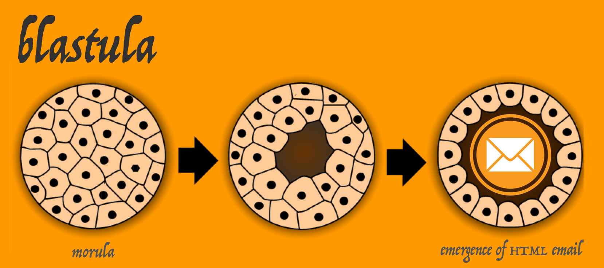

Sometimes we need to send out email messages based on the results of automated analysis processes. For these such instances, let's endeavor to send out some pretty-nice-looking HTML email messages. The **blastula** package makes it easy to send out HTML emails that are a little bit easier on the eyes. As an added bonus we can take advantage of both **markdown** and **R** code when composing our email text. The best way to demonstrate this is to just show an example workflow...

### Sending an email message

Here's an example that shows a basic workflow for composing the message, previewing the content, creating optional on-disk credentials for email, and sending out the message.

So far, the functions in this package are:

- `compose_email()`: generates the email message content inside the `email_message`-class object
- `preview_email()`: makes the email message created by `compose_email()` viewable in the RStudio Viewer
- `send_email_out()`: sends the HTML-based email to one or more recipients
- `create_email_creds_file()`: generates an optional on-disk, serialized file with email credentials

When you compose an email, you can use character objects in the global workspace and splice those into the message content. Here, I'll create a nicely formatted date/time string (`current_date_time`), and, assign a link to an web image to an object (`img_link`).

```r
library(magrittr)

# Get a nicely formatted date/time string
current_date_time <-
  paste0(
    format(Sys.time(), "%A, %B "),
    format(Sys.time(), "%d") %>% as.numeric(),
    ", ",
    format(Sys.time(), "%Y"),
    " at ",
    format(Sys.time(), "%l:%M") %>% trimws(),
    toupper(format(Sys.time(), " %p")),
    format(Sys.time(), " (%Z)"))

# Assign a very long image URL to `img_link`
img_link <-
  "https://marketplace.canva.com/MAA_AbacFmo/2/0/thumbnail_large/canva-basic-good-vibes-email-header-MAA_AbacFmo.jpg"
```

Now, we can use the `compose_email()` to compose the email! There are two main arguments here, `body` and `footer`. You can supply **markdown** text to each of these. So things like `##`, links, tables, and all other valid **markdown** conventions should render to valid HTML.

Furthermore, string interpolation is possible and it works by enclosing valid **R** code inside of curly braces (`{...}`). Below the image URL (as part of the `` **markdown** link contruction) is referenced to the `img_link` object from the global workspace. Note also that `{current_date_time}` references a character object that took quite a few piped statements of **R** to generate. The end result is the date/time string being nicely inserted in the footer of the email without complicating the `compose_email()` function call itself with lots of **R** statements.

We can also supply variables in the `compose_email()` function directly. For example, the `{sender}` part references an object *not* in the global workspace but rather it refers the named argument `sender = "Mike"` in the function call. (The order of searching is from within the function first, then the search moves to variables in the global environment.) 

```r
email_object <-
  compose_email(
    body = "
  ## Hiya! This is an email message. Exciting Right?
  Enjoy it. And this here image:

  
      
  **Yeah!** I seriously hope that you enjoy this \\
  message and the good vibes it will bring to you \\
  and yours.
  
  Peace out,

  {sender}",
    footer = 
  "Brought to you by Smile AG on {current_date_time}",
    sender = "Mike")
```

Some more notes on style are useful here. The `\\` is a helpful line continuation marker. It'll help you break long lines up when composing but won't introduce line breaks or new paragraphs. I recommend formatting like above with few indents so as not to induce the `quote`-type formatting. Any literal quotation marks should be escaped using a single `\`. Blank lines separating blocks of text result in new paragraphs. And, again, any valid **R** code can be enclosed inside `{...}` (e.g., `{Sys.Date()}`).

After creating the email message, you'll most certainly want to look at it to ensure that the formatting is what you want it to be. This is done with the `preview_email()` function. It's easy to use!

```r
# Preview the email
preview_email(email = email_object)
```

...and this is what I saw:


Looks good. Time to email this. I'd previously set up my email credentials in a file using the `create_email_creds_file()` function. Here's an example of how one might create a creds file as a hidden file in the home directory (`~`).

```r
# Create a credentials file to facilitate
# the sending of email messages
create_email_creds_file(
  file = "~/.email_file",
  sender = "correspondences@blastula.org",
  host = "smtp.blastula.org",
  port = 465,
  user = "have_a@blastula.org",
  password = "************")
```

Having generated that file, you can use the `send_email_out()` function to send the email. I sent the email just to myself but do note that the `recipients` argument can accept a vector of email addresses for mass mailings. If using a credentials file seems like not a very good practice, one can instead set a number of environment variables and use `Sys.getenv()` calls for email credentials arguments in the `send_email_out()` statement.

```r
# Sending email using a credentials file
send_email_out(
  message = email_object,
  from = "mike@smile.de",
  recipients = "riannone@me.com",
  subject = "This is NOT junk mail.",
  creds_file = "~/.email_file")
  
# Sending email using environment variables
send_email_out(
  message = email_object,
  from = "mike@smile.de",
  recipients = "riannone@me.com",
  subject = "This is NOT junk mail.",
  sender = Sys.getenv("bls_sender"),
  host = Sys.getenv("bls_host"),
  port = Sys.getenv("bls_host"),
  user = Sys.getenv("bls_username"),
  password = Sys.getenv("bls_password"))
```

Oddly enough, when I checked my email client, this message did appear in my Junk Mail folder. I fished it out, and this is how it appeared:


Which is great. The underlying HTML/CSS is meant to be resilient and display properly across a wide range of email clients and webmail services.

### Installation of the package

**blastula** is used in an **R** environment. If you don't have an **R** installation, it can be obtained from the [**Comprehensive R Archive Network (CRAN)**](https://cran.r-project.org/).

You can install the development version of **blastula** from **GitHub** using the **devtools** package.

```r
devtools::install_github("rich-iannone/blastula")
```

If you encounter a bug, have usage questions, or want to share ideas to make this package better, feel free to file an issue at [github](https://github.com/rich-iannone/blastula/issues).
