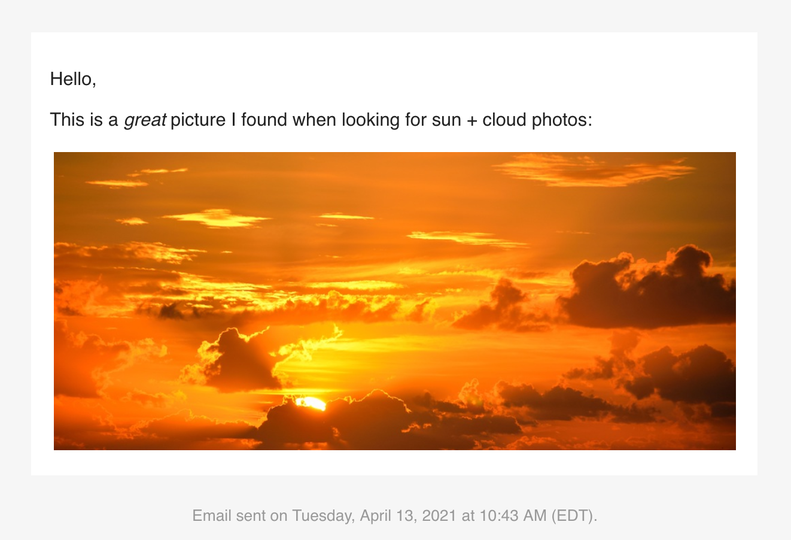

<!-- README.md is generated from README.Rmd. Please edit that file -->

# blastula <a href="https://rich-iannone.github.io/blastula/"></a>

<!-- badges: start -->

[](https://travis-ci.org/rich-iannone/blastula)
[](https://codecov.io/github/rich-iannone/blastula?branch=master)
<!-- badges: end -->

## Overview

The **blastula** package makes it easy to produce and send HTML email
from **R**. The message body can be highly customized with **Markdown**
text, the results of **R** expressions, and even raw HTML. The
underlying HTML/CSS is meant to display properly across a wide range of
email clients and webmail services.

### Composing an Email Message Object

Here’s an example that shows a basic workflow for composing the message,
creating optional on-disk credentials for email, and sending out the
message.

These functions can help us do just that:

  - `compose_email()`: generates the email message content inside the
    `email_message`-class object
  - `create_email_creds_file()`: generates an optional on-disk file with
    email credentials
  - `smtp_send()`: sends the HTML-based email to one or more recipients

A few other functions allow us to easily insert HTML fragments into the
message body. These are:

  - `add_image()`: for embedding a local image file into the message
    body
  - `add_ggplot()`: converts a ggplot plot object to an image for
    embedding
  - `add_imgur_image()`: simultaneously deploys an image to the
    **Imgur** service and provides an `` tag pointing to the
    external image
  - `add_readable_time()`: get the current time as a nicely readable
    string
  - `add_cta_button()`: add a call-to-action (CTA) button with button
    text and a link

## An Example

### Composing an Email Message

When you compose an email, you can use objects from the global workspace
and work them into the message content. Let’s create a nicely formatted
date/time string (`current_date_time`) with the `add_readable_time()`
function, and, assign a link to a web image to an object (`img_link`).

``` r
# Get a nicely formatted date/time string
current_date_time <- add_readable_time()

# Assign an URL with an image to `img_link`
img_link <- "https://i.imgur.com/p1KvgYj.png"
```

Now we use the `compose_email()` function to compose the email. There
are three main arguments here, `body`, `header`, and `footer`. You can
supply **Markdown** text to any of these. All other valid **Markdown**
conventions should render to valid HTML.

The insertion of HTML fragments or text can be performed by enclosing
valid R code inside of curly braces (`{...}`). Below the image URL (as
part of the `` **Markdown** link construction) is referenced
to the `img_link` object from the global workspace. Note also that
`{current_date_time}` references the `current_date_time` character
object generated earlier via the `add_readable_time()` function. The end
result is the insertion of the date/time string into the footer of the
email. (Alternatively, `add_readable_time()` could have been called
directly.)

``` r
# Generate the body text for the email message
email_text <- 
"
Hello,

This is a great photo of Lake Tahoe. I took \\
it using my new camera.


      
You *should go* if you get the chance.
"

email_object <-
  compose_email(
    body = email_text,
    footer = 
      "Email sent on {current_date_time}."
  )
```

After creating the email message, we can look at it to ensure that the
formatting is as expected. Simply call the object itself and it will be
displayed in the Viewer pane.

``` r
# Preview the email
email_object
```



### Sending an Email Message via SMTP

We can store SMTP email credentials in a file using the
`create_email_creds_file()` function. This will create a hidden
credentials file in the working directory. Having generated the
credentials file, we can use the `smtp_send()` function to send the
email.

``` r
# Sending email by SMTP using a credentials file
smtp_send(
  email = email_object,
  from = "personal@email.net",
  to = "another_user@web.net",
  subject = "Testing the `smtp_send()` function",
  creds_file = ".email_creds"
)
```

## Installation

The **blastula** package is moving toward using a new binary for `smtp`
mailing, provided by the **mailsend-go** project. This binary is
cross-platform and works on **Windows**, **macOS** (via **Homebrew)**,
and **Linux** (**Debian** and **RPM** packages). Information on
installation and other important considerations for SMTP sending can be
found in [this
article](https://rich-iannone.github.io/blastula/articles/sending_using_smtp.html).

You can install the in-development version of **blastula** from
**GitHub** using the **remotes** package.

``` r
install.packages("devtools")
remotes::install_github("rich-iannone/blastula")
```

If you encounter a bug, have usage questions, or want to share ideas to
make this package better, feel free to file an
[issue](https://github.com/rich-iannone/blastula/issues).

## Code of Conduct

Please note that this project is released with a [Contributor Code of
Conduct](CODE_OF_CONDUCT.md). By participating in this project you agree
to abide by its terms.

## License

MIT © Richard Iannone
