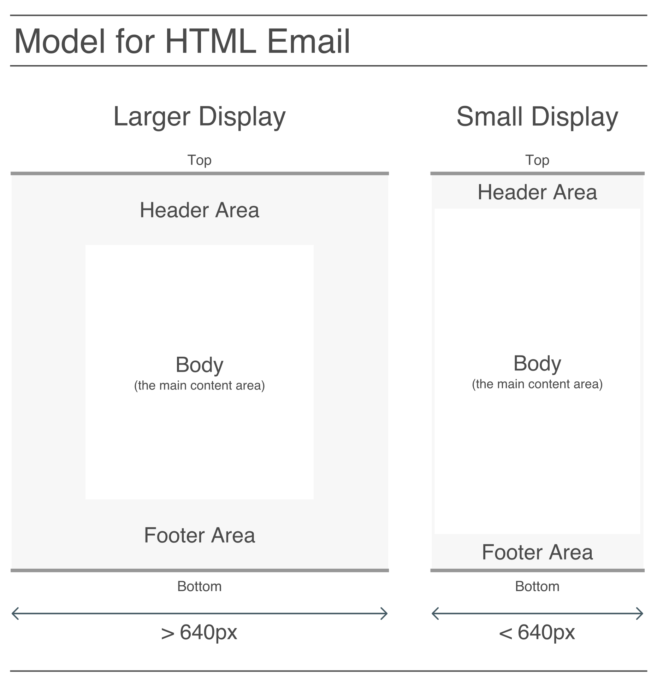
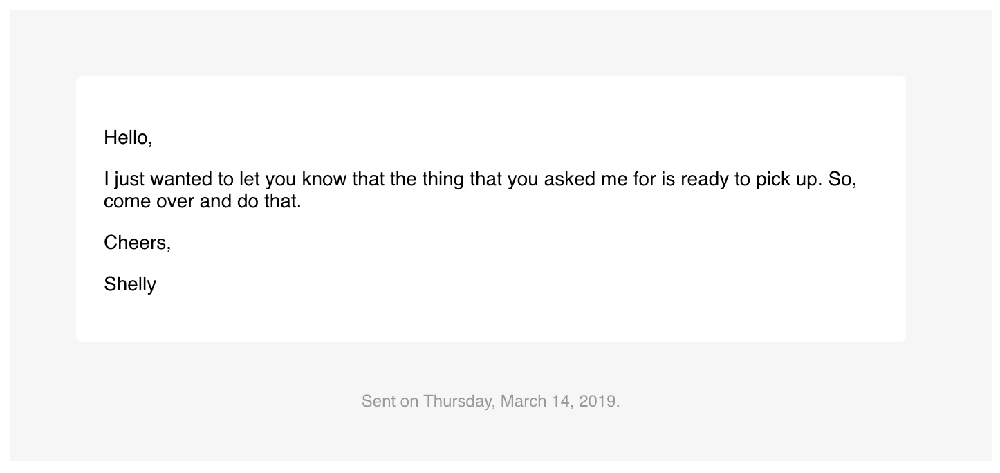
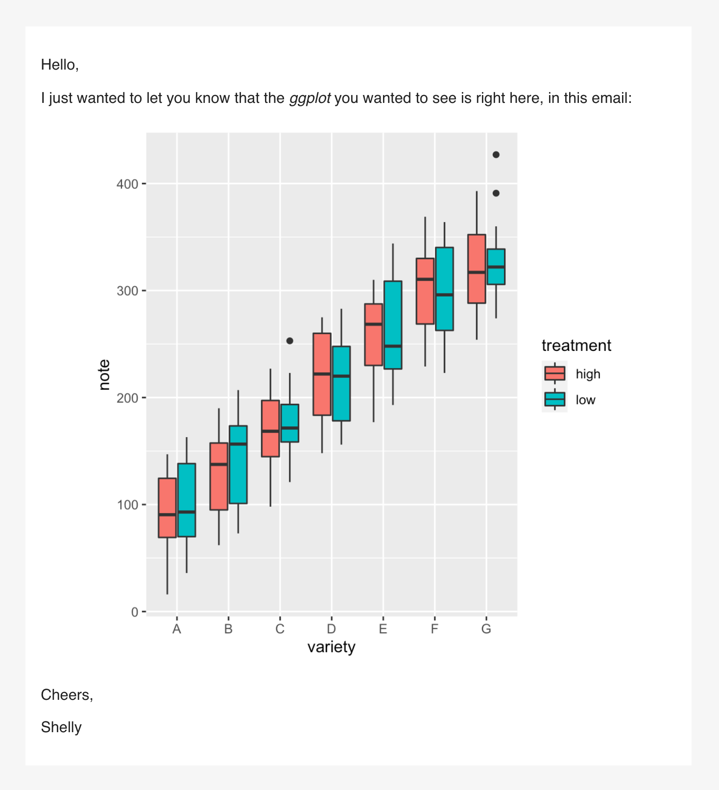

```{r, include = FALSE}
knitr::opts_chunk$set(
  collapse = TRUE,
  comment = "#>"
)
```

```{r library, include=FALSE}
library(blastula)
library(ggplot2)
library(glue)
```

Before we get to the process of creating an HTML email message, it's a good idea to learn about the model of such a message in **blastula**. Here is a diagram, and it doesn't contain too many layout components (because simplicity in HTML email is a good thing).

<br />



<br />

The main components (from top to bottom) are the **header**, the **body**, and the **footer**. The **body** content is inside of a wrapper that functions to differentiate the main content from whatever is in the **header** and **footer** (above and below the **body**).

Another thing to note is that the HTML used is responsive. Viewing the HTML in a viewport that is greater than or equal to 640 pixels will be different than seeing it with a viewport that's smaller. This is important because email on mobile devices will often take on the latter view, which is optimized for smaller display widths (e.g., larger font sizes, decreased vertical space between elements, resized images, etc.).

When using **blastula**, we don't have to worry much about either view since the API is designed to make emails look their best in both of them. Because we can preview the email message before sending it out, we have a chance to manually resize the browser and inspect the message in a variety of display widths.

## Creating a Simple HTML Email Message

For those times where we'd only want to send a simple HTML email message, we can use the `compose_email()` function and focus on adding text content to the **body** component. So let's create a simple email message using some plain text inside `body`.

```{r compose_simple, eval=FALSE}
compose_email(
  body = 
"Hello,

I just wanted to let you know that the thing that you asked me for is ready to pick up. So, come over and do that.

Cheers
")
```


<p align="center">This is how it looks, depending on the display width (wide at top, narrow below that).</p>
<br />

A preview of the HTML email message should appear in the Viewer. Try resizing the Viewer to see how it responds to the different width thresholds.

## More Sophisticated Email Text

A good strategy for longer and more complicated text inputs is to use the [**glue**](https://glue.tidyverse.org) package. That package allows us to use string interpolation (and avoid the use of `paste()` or `paste0()`). Variables in the global workspace can be included in the curly braces of a `glue()` string expression, and, any **R** expressions in `{ }` will be evaluated.

We can include longer **R** statements inside of the curly braces (like `{paste0(format(Sys.time(), "%A, %B "), format(Sys.time(), "%d") %>% as.numeric(), ", ", format(Sys.time(), "%Y"))}`), however, that would be unwieldy. It's better to generate local variables with **R** statements and just use those variables inside the `{ }`. 

Here is an example of the same email message body as in the last example, but using **glue** to preprocess our text:

```{r compose_simple_glue, eval=FALSE}
what <- "thing"
salutation <- "Cheers"

body_text <-
  glue(
    "
Hello,

I just wanted to let you know that the {what}
that you asked me for is ready to pick up. So,
come over and do that.

{salutation}
"   
  )

compose_email(body = body_text)
```

Any literal quotation marks inside the braces should be escaped using a single `\`. Blank lines separating blocks of text result in new paragraphs.

## Using Markdown Text via the `md()` Function

Markdown text can be used as input for the `body`, `header`, and `footer` arguments. To opt into using Markdown formatting, call the `md()` text helper function on any of these text elements. We can use the usual Markdown-formatting you know and you'll get italicized text, bold text, lists, links, etc. Have a look at [this reference page](https://commonmark.org/help/) to quickly understand how to use Markdown. The **blastula** package internally uses the **commonmark** **R** package to perform the conversion from Markdown to HTML.

A few notes on code style and options. It's good to left-align the text in the code example since it will reduce the risk of having four or more spaces after a line break, which will result in `text like this` when using Markdown formatting through `md()`. 

In the next example, let's first store the result of that statement in a local variable (`sending_date`). Then, the variable will be placed in the **footer** of the message (using the `footer` argument) along with leading text.

```{r compose_interpolation_stmt, eval=FALSE}
# Prepare the text inputs
sender_name <- "Shelly"

sending_date <-
  paste0(
    format(Sys.time(), "%A, %B "),
    format(Sys.time(), "%d") %>% as.numeric(),
    ", ",
    format(Sys.time(), "%Y")
  )

# Generate the body text
body_text <-
  md(glue(
    "
Hello,

I just wanted to let you know that the *thing* that
you asked me for is ready to pick up. So, come over
and do that.

Cheers,

{sender_name}
"    
  ))

# Generate the footer text
footer_text <- glue("Sent on {sending_date}.")

# Compose the email message
compose_email(
  body = body_text,
  footer = footer_text
)
```



<p align="center">Complicated string formatting goes into variables, the variables go into the email components</p>
<br>

Content in the **footer** and **header** sections is styled differently than **body** content (**footer** text will be somewhat smaller for one thing). The main message typically goes into the **body** whereas supplementary information works better in the **footer**.

## Adding an Image to an Email

The **blastula** package has the `add_image()` function which allows one to add images to an email message. What `add_image` does is generate an HTML fragment (a piece of HTML that can be included in an HTML document) with the image transformed to text (using Base64 encoding). Knowing that we have an HTML fragment is important because it means we need to use the `md()` function to interpret the content as Markdown/HTML (a Markdown parser will leave any HTML that it sees untouched).

```{r compose_local_image, eval=FALSE}
# Prepare the image (as a text input)
img_file_path <-
  system.file(
    "img", "rickenbacker_4001_1972.jpg",
    package = "blastula"
  )

image <- add_image(file = img_file_path)

# Generate the body text
body_text <-
  md(glue(
    "
Hello,

I just wanted to let you know that the **1972 Rickenbacker
4001** is here to pick up. Here is a picture of it:

{image}

Cheers,

{sender_name}
"
  ))

# Compose the email message
compose_email(body = body_text)
```


<p align="center">Once you get the hang of `add_image()`, this is really easy</p>
<br>

There's also the `add_ggplot()` function which can add a **ggplot2** plot object to a message body. Here's an example of how that works:

```{r compose_ggplot, eval=FALSE}
# Create the plot data
variety <- rep(LETTERS[1:7], each = 40)
treatment <- rep(c("high", "low"), each = 20)
note <- seq(1:280) + sample(1:150, 280, replace = TRUE)
data <- data.frame(variety, treatment, note)

# Create the plot
gg <-
  ggplot(data, aes(x = variety, y = note, fill = treatment)) + 
  geom_boxplot()

# Prepare the image (as a text input)
gg_image <- add_ggplot(plot_object = gg)

# Generate the body text
body_text <-
  md(glue(
    "
Hello,

I just wanted to let you know that the *ggplot* you \\
wanted to see is right here, in this email:

{gg_image}

Cheers,

{sender_name}
"
  ))

# Compose the email message
compose_email(body = body_text)
```



<p align="center">A ggplot in your email message</p>
<br>

I don't know about you but I'd love to get a ggplot in *my* email.

## Wrapping Up

We now know how to send really simple email messages with just some text, and, slightly more complex messages including those with images inside.
