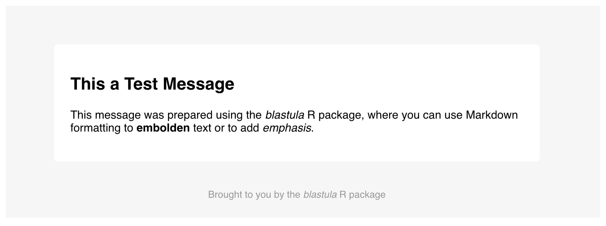

```{r, include = FALSE}
knitr::opts_chunk$set(
  collapse = TRUE,
  comment = "#>"
)
```

```{r library, include=FALSE}
library(blastula)
```

After we create the an `email_message` object with `compose_email()`, we can choose to send it through an SMTP server using **blastula**'s `smtp_send()` function. There is some system setup required before sending a **blastula** email message via SMTP. The main considerations are:

- installation of the cross-platform `mailsend-go` binary
- modifying an account-level setting on Gmail (if using that for sending email)
- optionally storing SMTP server and auth settings on disk

We'll go through each of these setup steps before getting into several sending examples with `smtp_send()`.

## Installation of `mailsend-go`

The **blastula** package is moving toward using a new binary for `smtp` mailing that's provided by the **mailsend-go** project. This binary is cross-platform and works on **Windows**, **macOS** (via **Homebrew**), and **Linux** (**Debian** and **RPM** packages are available).

### Windows

Get the latest [64-bit](https://github.com/muquit/mailsend-go/releases/download/v1.0.3/mailsend-go_1.0.3_windows_64-bit.zip) or [32-bit](https://github.com/muquit/mailsend-go/releases/download/v1.0.3/mailsend-go_1.0.3_windows_32-bit.zip) release.

Unzip and copy `mailsend-go-dir\mailsend-go.exe` to the Windows PATH. Optionally, we can place the executable in the working directory of the **R** project that is sending email.

### macOS (Homebrew)

Ensure that [Homebrew](https://brew.sh) is installed. Then use the following to install `mailsend-go`:

```
$ brew tap muquit/mailsend-go https://github.com/muquit/mailsend-go.git
$ brew install mailsend-go
```

### Ubuntu and Debian

Get the latest release of the [Debian package](https://github.com/muquit/mailsend-go/releases/download/v1.0.3/mailsend-go_linux_64-bit.deb). Then use the following to install `mailsend-go`:

```
$ sudo dpkg -i mailsend-go_linux_64-bit.deb 
```

### RPM Package

Get the latest release of the [RPM package](https://github.com/muquit/mailsend-go/releases/download/v1.0.3/mailsend-go_linux_64-bit.rpm). Then use the following to install `mailsend-go`:

```
$ rpm -Uvh mailsend-go_linux_64-bit.rpm
```

## Requirement for Using Gmail

Before using **Gmail** to send out email through **blastula**, there is a key **Gmail** account setting that must changed from the default value. We have to allow *Less Secure Apps* to use your the **Gmail** account. Details on how to make this account-level change can be found in [this support document](https://support.google.com/accounts/answer/6010255).

## Storing Credentials and SMTP Configuration Data for Later Use

While we can provide SMTP login and configuration information directly whenever we send email, it can be convenient to store this data for easy retrieval. It should be noted that the manually specifying credentials is more secure since no sensitive information is ever stored on disk (and password entry is obscured). Should you want to store credentials on-disk, however, there are two methods available for this:

1. Storing credentials in the system's key-value store
2. Storing credentials in a file

The first method is more secure since access to the system-wide key-value store requires authenication. The second is less secure since it is the user's responsibility to manage the resulting human-readable JSON file. We'll provide examples on how to use the both options effectively.

We can store email credentials in the system key-value store with the `create_email_creds_key()` function. Here is an example showing how to create an entry with an `id` of `"gmail_creds"`.

```{r creds_key_1, eval=FALSE}
# Store SMTP credentials using the
# system's secure key-value store;
# provide the `id` of "gmail"
create_smtp_creds_key(
  id = "gmail",
  user = "user_name@gmail.com",
  host = "smtp.gmail.com",
  port = 465,
  use_ssl = TRUE
  )
```

When executing this function, there will always be a prompt for the password (i.e., there is no `password` argument in this function).

We can also use preset SMTP settings. For example, if we would like to send email through **Gmail**, we can supply `provider = gmail` to not have to worry about the SMTP server details.

```{r creds_key_2, eval=FALSE}
# Store SMTP credentials in the
# system's key-value store with
# `provider = "gmail"`
create_smtp_creds_key(
  id = "gmail",
  user = "user_name@gmail.com",
  provider = "gmail"
  )
```

The credentials data can be later retrieved during email sending with the `creds_key()` credentials helper. Should you need to know which keys are set in the key-value store, we can use the `view_credential_keys()` function (which shows all keys by `id`, `key_name`, and `username`).

We can store email credentials in a file using the `create_email_creds_file()` function. Here is an example showing how to create a credentials file with the name `"gmail_creds"` in the working directory.

```{r creds_file_1, eval=FALSE}
# Store SMTP credentials as a file
# with the filename "gmail_creds"
create_email_creds_file(
  file = "gmail_creds",
  user = "user_name@gmail.com",
  host = "smtp.gmail.com",
  port = 465,
  use_ssl = TRUE
)
```

We can also use preset SMTP settings as with the `create_smtp_creds_key()` function. To send email through **Gmail** we can supply `provider = gmail` to avoid supplying `host`, `port`, and `use_ssl`.

```{r creds_file_2, eval=FALSE}
# Create a credentials file for sending
# email through Gmail
create_email_creds_file(
  file = "gmail_creds",
  user = "user_name@gmail.com",
  provider = "gmail"
)
```

The credentials data from this file can later retrieved during email sending with the `creds_file()` credentials helper.

## Sending Email 

Once the `mailsend-go` binary is installed and on the system path, we can use the in-development `smtp_send()` function for sending email. 

Currently, only the development version of the package (on **GitHub**) has the `smtp_send()` function. The other function for sending email, `send_email_out()`, will undergo deprecation.

Let's create a simple test message with the `prepare_test_message()` function.

```{r prepare_test_message, eval=FALSE}
# Create the test message, this returns
# an `email_message` object
test_message <- prepare_test_message()

# Preview the message in the Viewer
test_message
```

<p align="center"></p>

<p align="center">The test message</p>

Now that this test message is available, we can experiment with the sending of it to a personal email account. Here are three examples, each use a different method for supplying SMTP credentials.


```{r smtp_send_creds_manual, eval=FALSE}
# Sending email to a personal account
# through manual specification of SMTP
# credentials
test_message %>%
  smtp_send(
    from = "personal@email.net",
    to = "personal@email.net",
    subject = "Testing the `smtp_send()` function",
    credentials = creds(
      user = "user_name@gmail.com",
      provider = "gmail"
    )
  )
```


```{r smtp_send_creds_key, eval=FALSE}
# Sending email to a personal account
# using the credentials key
test_message %>%
  smtp_send(
    from = "personal@email.net",
    to = "personal@email.net",
    subject = "Testing the `smtp_send()` function",
    credentials = creds_key(id = "gmail")
  )
```


```{r smtp_send_creds_file, eval=FALSE}
# Sending email to a personal account
# using the on-disk credentials file
test_message %>%
  smtp_send(
    from = "personal@email.net",
    to = "personal@email.net",
    subject = "Testing the `smtp_send()` function",
    credentials = creds_file(file = "gmail_creds")
  )
```

If the SMTP credentials are correctly set, we will get the following message in the console:

```
The email message was sent successfully.
```

Should you have the `mailsend-go` executable in a location that is not in the system path or in the working directory, we can specify its exact location using the `binary_loc` argument.

```{r smtp_binary_loc, eval=FALSE}
# Use the `binary_loc` to provide the
# location of the `mailsend-go` binary
test_message %>%
  smtp_send(
    from = "personal@email.net",
    to = "personal@email.net",
    subject = "Testing the `smtp_send()` function",
    credentials = creds(
      user = "user_name@gmail.com",
      provider = "gmail"
    ),
    binary_loc = "/path/to/mailsend-go" 
  )
```

Want to debug the usage of the `mailsend-go` command during sending? We can use the `echo` and `dry_run` arguments. Setting `echo` to `TRUE` will be print the system command for mailing via `mailsend-go` to the console. Setting `dry_run` to `TRUE` will return information on the SMTP sending options. Furthermore, the function will stop short of actually sending the email message out.

```{r smtp_send_echo_dry_run, eval=FALSE}
# Perform a dry run of sending email and
# echo the system command
test_message %>%
  smtp_send(
    from = "personal@email.net",
    to = "personal@email.net",
    subject = "Testing the `smtp_send()` function",
    credentials = creds(
      user = "user_name@gmail.com",
      provider = "gmail"
    ),
    echo = TRUE,
    dry_run = TRUE
  )
```

```
The command for sending the email message is:

/usr/local/bin/mailsend-go -sub Testing the `smtp_send()` function -smtp smtp.gmail.com -port 465 -ssl auth -user user_name@gmail.com -pass ***** -from personal@email.net -to personal@email.net attach -file /var/folders/qz/mfwzxz914n16nj4__bnsbccr0000gn/T//RtmpKNmbDG/file583527f125f9.html -mime-type text/html -inline

This was a dry run, the email message was NOT sent.
```

## Concluding

This covers the basics on how to get up and running on sending emails through **blastula**'s SMTP functionality. Again, this article applies only to the in-development version of **blastula**, which can be installed using:

```{r install_github, eval=FALSE}
remotes::install_github("rich-iannone/blastula")
```

Because the `smtp_send()` is quite new, there are bound to be some problems with it. If you encounter a bug or just have a question or feature request, please file an [issue](https://github.com/rich-iannone/blastula/issues).
